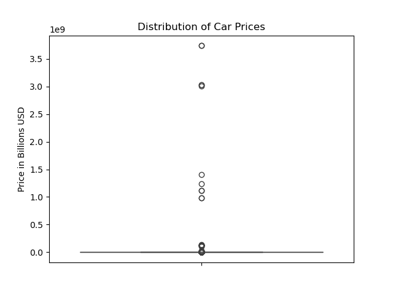
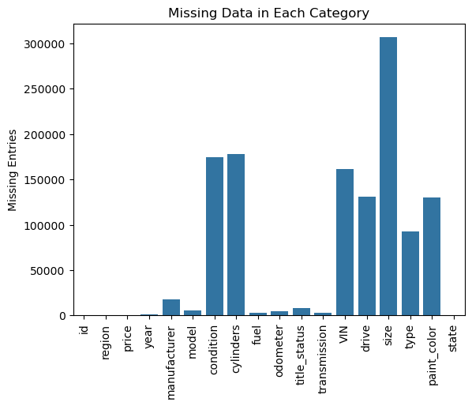
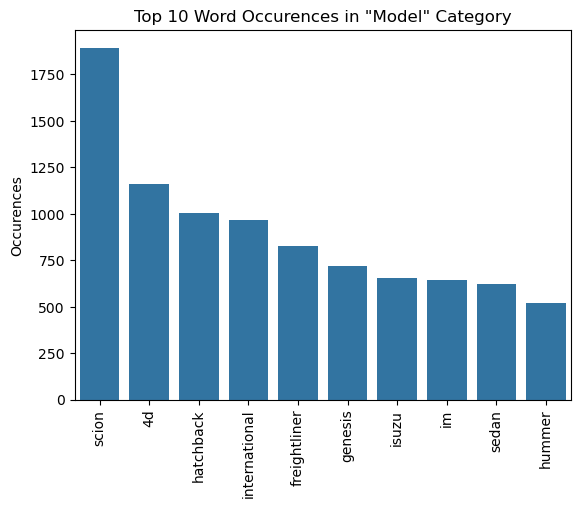

# What drives the price of a car?

**OVERVIEW**

In this report, I am acting a consultant to a used car dealership. The client has provided a dataset ([vehicles.csv](data/vehicles.csv)) that contains information on over 426k cars, including various details such as make, model, year, condition, and so on. My taks is to provide recommendations to my client as to what consumers value in a used car. This is a pretty vague instruction, but I will try my best!

The code and computation for this report is in the linked [Jupyter notebook](prompt_II.ipynb).

In approaching this problem, I am to follow the industry standard **CRISP-DM** framework for data science tasks:

    

First, we should start with a basic business understanding of what the business is trying to accomplish through this analysis.

### Business Understanding

As a used car dealership, it is important to us to understand what an appropriate market price is for the cars we sell. This dataset contains a large number of used cars with various details about them and how much they sold for. Using this large dataset, we can construct a theoretical model of how much each of these different details contributes to the market value of a car. This model can then, hopefully, be used to predict with decent precision the expected value of other cars that are not in the dataset and have not been sold yet. In doing so, the prices we set can be as attuned as possible to the details of the market, maximizing business profits.

### Data Understanding

An investigation of the data reveals the information that we have to work with. There are a few important numerical columns, namely, price, year, and odometer.

One issue that immediately comes to light when looking through these columns is that we have some problematic outlier price and odometer data. Here is a boxplot of all the car prices, showing the problem with the distribution.

Cars should not be costing billions of dollars! Looking into this further, many of these prices are clearly placeholder values, such as '123456789'. A similar issues is present with odometer values.

There is also a lot of missing data in many of the other categorical columns. This graph shows the % missing data in each of the relevant categorical columns:

Another issue arises in the 'model' column. There are over 13k models listed, and upon further investigation, many of these entries are just not formatted very well. Some contain the manufacturer, while leaving the manufacturer column blank, some contain the year, some contain other info that should be in other columns, and the formatting and ordering of the words is inconsistent. This makes this column very unweildy and difficult to work with.

If we split the entries in the model column into individual words and make a chart of the most common words, we see the following

'scion' is a brand, 'sedan' is a car type not a model, etc.

These issues will make building a very high precision model quite difficult, I would think. But a decent model can still be made with some data cleaning. I think that if I had more time and resources, I could probably get more clever and be more extensive about the data cleaning.

This leads us into the next section, data preparation.

### Data Preparation

First, to deal with the missing data, I did a mix of dropping rows (cars) that were missing lots of data, and imputing (filling in the category as 'unknown' where it was previously blank/null).

Next, to deal with the issue of problematic outlier/placeholder price and odometer data, I dropped all cars with a stated price of over \$400k, and a stated odometer reading of over \$500k.

I also dropped the columns that are either irrelevant to the model (id, VIN), and columns that add a lot of complexity with unclear benefit (state and region). One thing that would be helpful to know (and I would know this in real life) is where my client is/is planning on selling cars, which would allow me to tailor my model to their state/region needs. Since I don't know that in this assignment, and I just don't want to drastically increase the complexity of my model here, I just drop these columns for this assignment.

For the 'model' column, I mentioned there were 13k individual values, many of them including the manufacturer or year or other information. I decided to drop this column, but first I did a little trickery to use the model column to fill in some of the missing 'manufacturer' data. As we saw in the chart above of individual words in the model column, many of them are manufacturers, and I noticed that most of these cars which have a manufacturer listed in the model column are missing data in the manufacturer column. So, I used some code trickery to transfer the manufacturer into its proper column for many of these cars which have brands listed.

(There was also an issue where some of the manufacturers were misspelled, such as 'chevorlet' instead of 'chevrolet', and 'volkswagon' instead of 'volkswagen'. I corrected this issue in my data cleaning as well.)

I added or corrected the following manufacturers from the model column:

{'chevorlet': 'chevrolet', 'volkswagon': 'volkswagen', 'scion': 'scion', 'freightliner': 'freightliner', 'genesis': 'genesis', 'isuzu': 'isuzu', 'oldsmobile': 'oldsmobile', 'maserati': 'maserati', 'suzuki': 'suzuki', 'saab': 'saab', 'corvette': 'corvette', 'lamborghini': 'lamborghini', 'rolls royce': 'rolls royce'}

After this, I dropped the model column.

At this point, I am left with the target column (price), two numerical columns (year and odometer), and ten categorical columns.

In order to make the year column more workable, I transformed it into an age column, by subtracting all of the years from the last year of data collection (2022).

Next I created polynomial features of degree 3 out of the age and odometer columns, adding 'age^2' 'age odometer' 'odometer^2' 'age^3'	'age^2 odometer' 'age odometer^2' and 'odometer^3' columns for my regression models to work with.

Next, I scaled all of these columns to normalize them using StandardScaler.

Next, I took the ten remaining categorical columns and encoding them using one-hot encoding. This led to a total of 132 columns for 410k remaining cars as my final dataset in preparation for the modeling stage.

### Modeling

In the modeling stage, I built multiple different regularized models using ridge and lasso regression and GridSearchCV, testing a wide variety of different hyperparameters (alpha) from 10^-5 to 10^4, and using 5-fold cross-validation. (However, lasso regression was running much slower for me than ridge regression, so I used fewer test alpha values, and only used 3-fold cross-validation to increase the speed of processing. Obviously, with more compute this would not have been necessary.) I also tested a variety of different scoring metrics (mse, mae, and medae). What I found is that all of the models I tested performed almost identically, giving a mean absolute error of around \$6,888, and a median absolute error of between \$4,070 and \$4,091.

### Evaluation

The models that I created performed ok - a mae of \$6800 and a medae of \$4000 is respectable, but not super precise. I think that the messiness of the original dataset was quite difficult to deal with here. I had to throw out the model column almost entirely. I think that with some data that was better collected, or more precisely transcribed, it would have been easier to build a more precise model. In addition, with more time and resources I could have potentially undertaken a much more extensive data cleaning operation, revealing more useful information that the model could use to make its predictions more precise.

### Deployment

A lot of the feedback that I have for the client, as I have already described extensively throughout this report, has to do with data collection and transcription. A lot of the data here is quite messy and hard to work with, or missing completely. A standardized list of the most common car models that my client cars most about would be really helpful. If my client sells, for example, a lot of Ford F-150s, we could build an individual model for just Ford F-150s, and that would be far higher precision for those specialized cases than this general model. But doing that untargeted in this exercise would be building far too many models without that additional info from my client.

In other words, I guess that part of the takeaway here is that business understanding is extremely important for this kind of task. Because this is not a real report for a real client, I find that my business understanding of what my client is looking for is extremely vague, because all we know is that it is some generic used car dealership. In the real world, I imagine that I would want to ask a lot about exactly what their business looks like, where it is located, what kinds of cars they sell most often, and so on. Indeed, a dataset of cars that my client has sold in the past would help a lot.

Along similar lines, something that jumps out is the effect of antique cars on the used car market. Generally, as a car gets older, its value decreases - until you get to rare antiques, where the value skyrockets. If my client only ever sells 'normal' used cars, and doesn't sell rare antiques, we could exclude all of those from the dataset, and build a model that is much more sensitive to the price of 'normal' used cars. This model would perform much worse on rare antiques, but going back to the business understanding, the point of the model is to help the business, and it doesn't matter if the model performs poorly on a category of car that is irrelevant to the business. My client would happily take that tradeoff to increase modeling precision on its actual inventory.